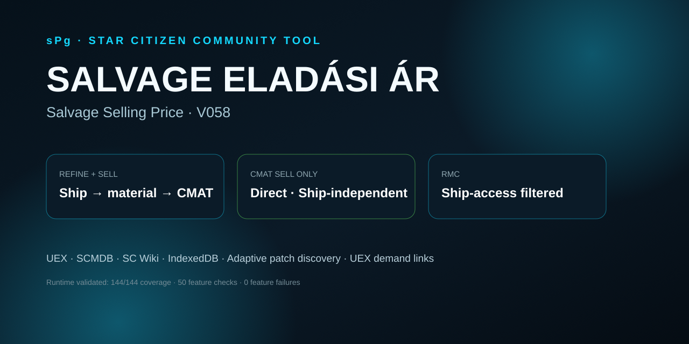
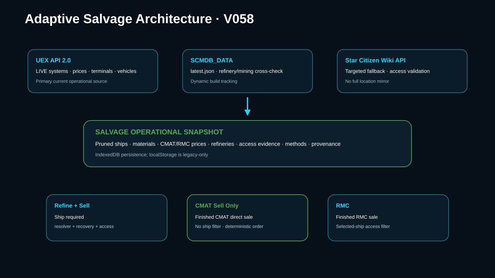
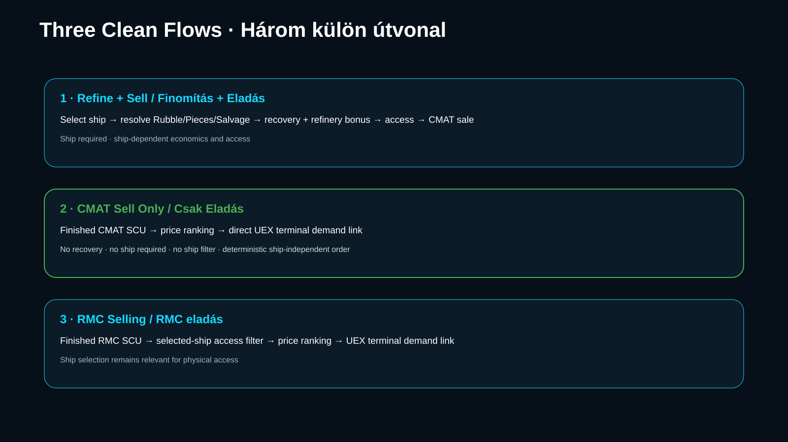
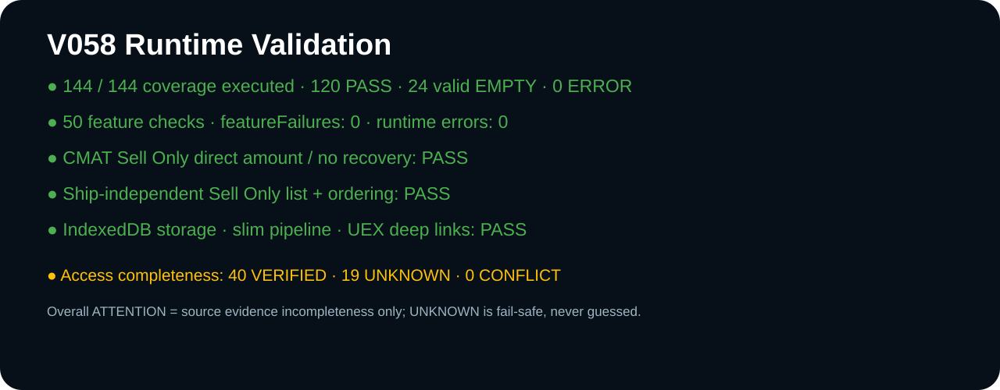

# sPg Salvage Selling Price



## What is it for?

**sPg Salvage Selling Price** is a browser-based, single-file Star Citizen Salvage economic helper with three deliberately separated flows:

- **Refine + Sell:** resolves the structural raw material from the selected salvage ship, applies evidenced recovery/bonus rules, then ranks refinery + CMAT sale routes.
- **CMAT Sell Only:** the entered amount is already-finished CMAT. No gross→net conversion, recovery, refining loss, ship-access filter, or ship-dependent ordering is applied.
- **RMC selling:** ranks finished RMC sale locations while filtering by verified access for the selected salvage ship.

Demand is intentionally not duplicated into a fast-staling local model: material headings and result locations link directly to the relevant UEX demand views.

## What changed in V056–V058?

**V056 – Sell Only Direct CMAT:** Sell Only uses the entered CMAT SCU unchanged; recovery/refining loss belongs only to Refine + Sell.

**V057 – Sell Only Ship Independent:** selling finished CMAT no longer requires a salvage ship and ship selection cannot filter CMAT sale locations. Refine + Sell still requires a ship; RMC still uses ship-access filtering.

**V058 – Sell Only Deterministic:** equal-price CMAT tie-break ordering can no longer use ship-access weight, so the complete Sell Only list, order, and prices remain identical across all ship selections.

## Core features

- HU / EN UI.
- Salvage ship required for Refine + Sell.
- Ship not required and not influential for CMAT Sell Only.
- RMC continues to use selected-ship access filtering.
- Ship → structural material resolver: Salvation/Vulture/Fortune→Rubble; MOTH→Pieces; Reclaimer→Salvage.
- Provenance-bound community fallback recovery when no usable current-LIVE direct audit exists: Rubble 40%, Pieces 20%, Salvage 15.2%.
- Material-isolated bonuses: Rubble Levski +9%, Pieces no explicit dedicated bonus, Salvage Levski +8%, only where supported.
- Dinyx / Pyrometric selection; no method-specific recovery delta is invented.
- Top 3 / All results and Surface / Space filters.
- S/M/L may use verified sufficient hangar or landing pad; XL requires verified XL hangar + docking.
- Dynamic UEX LIVE-system discovery.
- SCMDB build tracking through `latest.json`.
- Targeted Star Citizen Wiki fallback instead of full location mirroring.
- IndexedDB-only runtime persistence; localStorage is not a runtime dependency.
- Small **Salvage Operational Snapshot** cache instead of full upstream datasets.
- Clickable CMAT/RMC headings and terminal-specific UEX demand deep links.
- Built-in diagnostics and regression feature gates.



## Usage

### Refine + Sell

1. Select a salvage ship.
2. Enter raw structural salvage SCU.
3. Select Dinyx or Pyrometric.
4. Apply location and Top 3 / All filters.
5. Ranking uses the ship-specific Rubble/Pieces/Salvage recovery and access rules.

### CMAT Sell Only

1. Select **Sell Only**.
2. Enter your already-finished CMAT under **CMAT to sell, SCU**.
3. No ship selection is required.
4. The full entered amount is used directly; no recovery, refining loss, ship filtering, or ship-dependent ordering exists.

### RMC

1. Select a salvage ship because RMC ship-access filtering remains active.
2. RMC SCU is optional for viewing prices; enter it for total revenue.
3. Use the same location and result filters.

The **Construction Materia CMAT** and **Recycled Material Composite RMC** headings open general UEX demand pages. Result location names open the exact commodity + terminal demand view.



## Data sources and precedence

**UEX API 2.0:** current prices, terminals, LIVE systems, vehicle `pad_type`, location `pad_types`, and other direct operational fields.

**SCMDB_DATA:** current mining/refinery build selected through `latest.json` and used for cross-checking.

**Star Citizen Wiki API:** targeted secondary/fallback validation, especially access and commodity/vehicle relationships. Older secondary evidence must not override newer direct LIVE evidence.

**Recovery precedence:** usable current-LIVE direct audit → provenance-bound `COMMUNITY_MEASURED` → legacy 1/6 only for UNKNOWN/unmapped future material.

Details: [docs/DATA-SOURCES.en.md](docs/DATA-SOURCES.en.md)

## Automatic patch tracking

The app is not frozen to one patch. LIVE systems, SCMDB build, and SC Wiki default version are discovered at runtime. Normal data changes such as prices, terminals, refineries, or LIVE systems can flow in without per-patch rewrites.

New mechanic semantics are never guessed. A new structural material or unproven ship→material relationship must surface UNKNOWN/FAIL until supported by evidence.

## V058 runtime validation

The supplied V058 user-runtime log executed 144/144 coverage checks: 120 PASS, 24 valid EMPTY, 0 ERROR. All 50 feature checks are clear, `featureFailures: []`, and runtime `errors: []`. Direct CMAT Sell Only amount semantics, no-recovery behavior, ship-independent results, and ship-independent tie-break ordering all PASS.

Overall `ATTENTION` remains only because 19 of 59 relevant facilities lack sufficient source evidence for access. They stay UNKNOWN rather than being guessed.



## Single-file release

The user release remains one standalone HTML file. Repository documentation, CI, test artifacts, and images are not required to run the app.

## License and legal status

Original project code and project-created documentation are MIT-licensed unless stated otherwise. This does not relicense Star Citizen/CIG/RSI IP, UEX data/services, Star Citizen Wiki content, SCMDB_DATA data, or community sources. The app contains a visible bilingual unofficial fan-tool notice.

See [LICENSE](LICENSE), [NOTICE.md](NOTICE.md), [THIRD_PARTY_NOTICES.md](THIRD_PARTY_NOTICES.md), and [docs/LEGAL.en.md](docs/LEGAL.en.md).

## Development / Codex

The development baseline is the exact runtime-validated V058 `index.html`. Codex or another developer must read [AGENTS.md](AGENTS.md) and [STATUS.md](STATUS.md) first. Current Sell Only invariants must not be reopened without new evidence or explicit scope.

Offline release gate:

```bash
node tools/check-release.mjs
```

## Release standard

This repository package is prepared under [Universal Professional GitHub Release Master Standard V4.1](docs/RELEASE_STANDARD.md). Project-specific gates are recorded in the [Release Contract](docs/RELEASE-CONTRACT.md), and final evidence/limitations in the [Release Audit](docs/RELEASE-AUDIT-V4.1.md). The V058 application artifact remains byte-identical.
