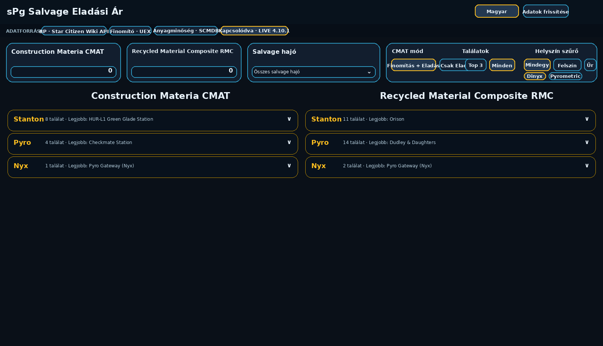
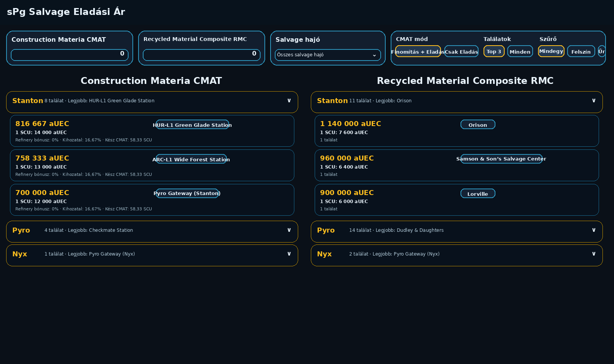
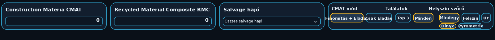

# sPg Salvage Selling Price / sPg Salvage Eladási Ár

[Magyar](#magyar) · [English](#english)

A bilingual, single-file Star Citizen salvage planning tool for comparing **Construction Material Salvage (CMATS) → Construction Materials (CMAT)** refining/sale options and **Recycled Material Composite (RMC)** direct sale prices across LIVE systems.



---

# Magyar

## Mire való?

Az **sPg Salvage Eladási Ár** abban segít, hogy gyorsan lásd:

- hol érdemes **CMATS-t finomítani és ugyanott CMAT-ként eladni**;
- hol érdemes a már kész **CMAT-ot közvetlenül eladni**;
- hol a legjobb az **RMC közvetlen eladási ára**;
- melyik hely használható a kiválasztott salvage hajóval;
- mely találatok földi vagy űrbeli helyek;
- rendszerenként a Top 3 vagy az összes releváns találatot.

Az alkalmazás két fő mennyiséget kér: **bruttó CMATS SCU** és **RMC SCU**. A többi adatot az aktuális forrásokból tölti le.

## Gyors használat

1. Írd be a nyers **CMATS** mennyiséget.
2. Ha RMC-t is össze akarsz hasonlítani, add meg az **RMC SCU** mennyiséget is.
3. Válassz salvage hajót, vagy hagyd az **Összes salvage hajó** beállítást.
4. CMAT-nál válassz:
   - **Finomítás + Eladás** – ugyanazon hely refinery + CMAT eladás;
   - **Csak Eladás** – kész CMAT legjobb eladási helyei.
5. Válassz **Top 3 / Minden**, illetve **Mindegy / Felszín / Űr** szűrőt.
6. Finomításnál választható **Dinyx** vagy **Pyrometric**.
7. Nyisd le a **Stanton / Pyro / Nyx** rendszerkártyákat.

A találatoknál a fő kiemelt szám a **teljes eladási érték**, alatta az **1 SCU-ra jutó ár** látható. Azonos gazdasági eredményeknél a helyek összevonva jelenhetnek meg.



## Felső vezérlők



- **Construction Materia CMAT** – nyers CMATS mennyisége.
- **Recycled Material Composite RMC** – közvetlenül eladandó RMC mennyisége.
- **Salvage hajó** – hajóhozzáférés szerinti szűrés.
- **CMAT mód** – Finomítás + Eladás / Csak Eladás.
- **Találatok** – Top 3 / Minden.
- **Helyszín szűrő** – Mindegy / Felszín / Űr.
- **Dinyx / Pyrometric** – magas hozamú refinery módszerek.
- **Adatok frissítése** – újra lekéri a LIVE adatokat.
- **Log másolása** – részletes diagnosztikát és automatikus coverage tesztet másol a vágólapra.
- **Cache törlése** – törli a helyi cache-t és újratölti az oldalt.

## Adatforrások

A program futás közben több forrást használ:

- **UEX API 2.0** – árak, terminálok, refinery-adatok, jármű- és location mezők elsődleges LIVE forrása;
- **SCMDB_DATA** – refinery-lista és refinery profilok keresztellenőrzése;
- **Star Citizen Wiki API** – commodity kapcsolat, hajóadatok és explicit **Hangar / Landing Pad** amenity ellenőrzés.

A felső állapotsáv mindig mutatja, milyen LIVE / SCMDB / Wiki verzióból dolgozik az oldal.

## Hajó- és hozzáférési szabály

A program nem talál ki hiányzó hangárméretet.

- S/M/L hajónál megfelelő méretű, igazolt **Hangar vagy Landing Pad** elfogadható.
- XL hajónál kizárólag **igazolt XL Hangar + Docking** együtt elfogadható.
- XL Landing Pad önmagában nem elég.
- Docking önmagában nem elég.
- Ismeretlen vagy valóban ütköző hozzáférési adatnál a hely kiesik a kiválasztott hajó rangsorából.
- UEX aktuális LIVE adat az elsődleges; egy régebbi, azonos minor SC Wiki rekord nem írhatja felül a frissebb UEX LIVE adatot.

## CMATS → CMAT számítás

A program a refinery bónuszt és a CMAT eladási árat együtt használja. A **Finomítás + Eladás** rangsorban csak olyan hely szerepelhet, ahol a refinery és a CMAT eladás ugyanazon facilityhez biztonságosan párosítható.

Fontos korlátozás: a jelenlegi források nem adnak igazolt CMATS alap-konverziós rátát. Emiatt a program **1/6 = 16,67% becsült alapkihozatalt** használ fallbackként, és ezt a felületen is *nem igazolt* állapotként jelzi. A Dinyx és Pyrometric választás ettől még megmarad, de módszerspecifikus CMATS audit nélkül ugyanaz a fallback alap használatos.

## Diagnosztika és V039 validáció

A `Log másolása` automatikusan végigellenőrzi a fő kombinációkat. A V039-hoz mellékelt 2026-09-22-i log eredménye:

- **144 / 144** ellenőrzés lefutott;
- **120 PASS**;
- **24 EMPTY** – nincs gazdasági jelölt az adott szűrőkombinációra;
- **0 UNKNOWN HANGAR** a funkcionális coverage-ben;
- **0 CONFLICT**;
- **0 ERROR**;
- coverage futás: kb. **1,2 s**;
- külön operational access audit: **59 helyből 47 VERIFIED, 12 UNKNOWN, 0 CONFLICT**.

Ezért az összesített diagnosztika **ATTENTION**, nem teljes zöld PASS. A 12 UNKNOWN helyet a program nem találja ki és hajószűrésnél biztonságosan kizárja. Jelenleg ide tartozik többek között Reclamation & Disposal Orinth, Picker's Field, Rappel, Dunboro, Green Imperial Housing Exchange, Samson & Son's Salvage Center, Brio's Breaker Yard, Devlin Scrap & Salvage, valamint a négy Nyx People's Service Station refinery hely.

A Star Citizen Wiki LIVE csatorna a log pillanatában **4.10.0-LIVE.12519617**, míg a UEX LIVE **4.10.1** volt, ezért az oldal ezt külön verziófigyelmeztetésként mutatja.

## Telepítés / GitHub Pages

Az alkalmazás runtime szempontból továbbra is **egy önálló HTML fájl**.

- GitHub Pageshez a repo gyökerében lévő `index.html` használható.
- `Settings → Pages → Deploy from a branch → main / root`.
- Nincs build step, npm, backend vagy telepítendő dependency.
- A `release/sPg_salvage_eladasi_ar_V039.html` ugyanennek a verziózott standalone kiadása.

A dokumentáció és a képek csak a GitHub repó bemutatásához kellenek; az alkalmazás működéséhez nem.

---

# English

## What is it for?

**sPg Salvage Selling Price** is a bilingual Star Citizen helper that compares:

- **CMATS refining + same-facility CMAT sale**;
- direct sale of already refined **CMAT**;
- direct **RMC** sale prices;
- ship/location access compatibility;
- surface vs. space locations;
- Top 3 or all useful results per LIVE system.

It only needs two optional amounts from the user: gross **CMATS SCU** and **RMC SCU**. The rest is loaded from current external data sources.

## Quick start

1. Enter the raw **CMATS** amount.
2. Optionally enter the **RMC** amount.
3. Select a salvage ship or keep **All salvage ships**.
4. For CMAT choose:
   - **Refine + Sell** – refinery and CMAT sale at the same facility;
   - **Sell Only** – best sale locations for finished CMAT.
5. Select **Top 3 / All** and **Any / Surface / Space**.
6. For refining choose **Dinyx** or **Pyrometric**.
7. Expand the **Stanton / Pyro / Nyx** cards.

The primary highlighted value is the **total sale value**, with the **price per 1 SCU** shown below it. Equal economic results can be grouped together.

## Data sources

- **UEX API 2.0** – primary LIVE source for prices, terminals, refinery fields, vehicles and location access data;
- **SCMDB_DATA** – cross-check for refinery locations and refinery profiles;
- **Star Citizen Wiki API** – commodity relationship, vehicle data, and explicit Hangar / Landing Pad amenities.

## Ship access policy

The app does not invent missing hangar data.

- S/M/L ships may use a sufficiently sized verified **Hangar or Landing Pad**.
- XL ships require a verified **XL Hangar + Docking**.
- An XL Landing Pad alone is not enough.
- Docking alone is not enough.
- Unknown or real source conflicts are excluded for the selected ship.
- Current UEX LIVE data is primary; an older same-minor Wiki record cannot veto newer UEX LIVE access data.

## CMATS → CMAT model

For **Refine + Sell**, the app combines estimated refined CMAT with the sale price at the same safely matched facility.

Current public data does not provide a verified CMATS base conversion ratio. Therefore V039 uses an explicit **1/6 = 16.67% estimated fallback base recovery**. It is shown as *unverified* in the UI. Dinyx and Pyrometric remain selectable, but without a method-specific CMATS audit they share the same fallback base recovery.

## V039 validation snapshot

The attached 2026-09-22 diagnostic run completed:

- **144 / 144** checks;
- **120 PASS**;
- **24 EMPTY** because no economic candidate exists for those filter combinations;
- **0 UNKNOWN HANGAR** in functional coverage;
- **0 CONFLICT**;
- **0 ERROR**;
- coverage runtime about **1.2 seconds**;
- independent operational access audit: **47 VERIFIED / 12 UNKNOWN / 0 CONFLICT** across 59 relevant facilities.

The overall diagnostic is therefore **ATTENTION**, not a fully green PASS. The 12 UNKNOWN facilities are deliberately not guessed and are safely excluded when ship compatibility requires verified access.

At the captured run, UEX LIVE was **4.10.1**, SCMDB matched **4.10.1-live.12660092**, while the Star Citizen Wiki LIVE channel exposed **4.10.0-LIVE.12519617**. The application surfaces that version mismatch instead of hiding it.

## GitHub Pages

The runtime remains a **single self-contained HTML application**.

- `index.html` is ready for GitHub Pages.
- Use `Settings → Pages → Deploy from a branch → main / root`.
- No build process, npm, backend or local runtime assets are required.
- `release/sPg_salvage_eladasi_ar_V039.html` is the versioned standalone copy.

Documentation and screenshots are repository assets only and are not runtime dependencies.

---

## Repository layout

```text
.
├── index.html                              # GitHub Pages entry, V039
├── release/
│   └── sPg_salvage_eladasi_ar_V039.html  # standalone release copy
├── docs/images/                            # documentation screenshots
├── README.md                               # bilingual public documentation
├── AGENTS.md                               # durable development rules
├── STATUS.md                               # short current project state
├── IMPORT_HANDOFF.md                       # one-time first Codex takeover context
├── CODEX_TAKEOVER_PROMPT.txt               # concise first takeover prompt
├── DISCORD_POST_HU.txt
├── DISCORD_POST_EN.txt
├── checksums.sha256
├── .gitignore
└── .nojekyll
```

## Disclaimer

This is a community Star Citizen helper. Data can change with patches, backend updates and source synchronization. Always pay attention to the LIVE/version badges and warnings shown by the application.
